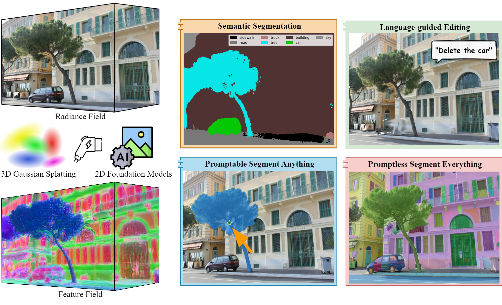

# Feature 3DGS 🪄: Supercharging 3D Gaussian Splatting to Enable Distilled Feature Fields


Shijie Zhou, Haoran Chang*, Sicheng Jiang*, Zhiwen Fan, Zehao Zhu, Dejia Xu, Pradyumna Chari, Suya You, Zhangyang Wang, Achuta Kadambi (* indicates equal contribution)<br>
| [Webpage](https://feature-3dgs.github.io/) | [Full Paper](https://arxiv.org/abs/2312.03203) | [Video](https://www.youtube.com/watch?v=h4zmQsCV_Qw) | [Viewer Pre-built for Windows](https://drive.google.com/file/d/1DRFrtFUfz27QvQKOWbYXbRS2o2eSgaUT/view?usp=sharing)<br>
 

<!-- <a href="https://www.inria.fr/"> </a>
<a href="https://univ-cotedazur.eu/"> </a>
<a href="https://www.mpi-inf.mpg.de"> </a> 
<a href="https://team.inria.fr/graphdeco/"> </a> -->

Abstract: *3D scene representations have gained immense popularity in recent years. Methods that use Neural Radiance fields are versatile for traditional tasks such as novel view synthesis. In recent times, some work has emerged that aims to extend the functionality of NeRF beyond view synthesis, for semantically aware tasks such as editing and segmentation using 3D feature field distillation from 2D foundation models. However, these methods have two major limitations: (a) they are limited by the rendering speed of NeRF pipelines, and (b) implicitly represented feature fields suffer from continuity artifacts reducing feature quality. Recently, 3D Gaussian Splatting has shown state-of-the-art performance on real-time radiance field rendering. In this work, we go one step further: in addition to radiance field rendering, we enable 3D Gaussian splatting on arbitrary-dimension semantic features via 2D foundation model distillation. This translation is not straightforward: naively incorporating feature fields in the 3DGS framework encounters significant challenges, notably the disparities in spatial resolution and channel consistency between RGB images and feature maps. We propose architectural and training changes to efficiently avert this problem. Our proposed method is general, and our experiments showcase novel view semantic segmentation, language-guided editing and segment anything through learning feature fields from state-of-the-art 2D foundation models such as SAM and CLIP-LSeg. Across experiments, our distillation method is able to provide comparable or better results, while being significantly faster to both train and render. Additionally, to the best of our knowledge, we are the first method to enable point and bounding-box prompting for radiance field manipulation, by leveraging the SAM model.*

<section class="section" id="BibTeX">
  <div class="container is-max-desktop content">
    <h2 class="title">BibTeX</h2>
    <pre><code>@inproceedings{zhou2024feature,
  title={Feature 3dgs: Supercharging 3d gaussian splatting to enable distilled feature fields},
  author={Zhou, Shijie and Chang, Haoran and Jiang, Sicheng and Fan, Zhiwen and Zhu, Zehao and Xu, Dejia and Chari, Pradyumna and You, Suya and Wang, Zhangyang and Kadambi, Achuta},
  booktitle={Proceedings of the IEEE/CVF Conference on Computer Vision and Pattern Recognition},
  pages={21676--21685},
  year={2024}
}</code></pre>
  </div>
</section>


# Environment setup
Our default, provided install method is based on Conda package and environment management:
<!-- ```
conda env create --file environment.yml
conda activate feature_3dgs
``` -->

```shell
conda create --name feature_3dgs python=3.8
conda activate feature_3dgs
```
PyTorch (Please check your CUDA version, we used 11.8)
```shell
pip install torch==2.4.0 torchvision==0.19.0 torchaudio==2.4.0 --index-url https://download.pytorch.org/whl/cu118
```

Required packages
```shell
pip install -r requirements.txt
```

Submodules

<span style="color: orange;">***New***</span>: Our Parallel N-dimensional Gaussian Rasterizer now supports RGB, arbitrary N-dimensional Feature, and Depth rendering.
```shell
pip install submodules/diff-gaussian-rasterization-feature # Rasterizer for RGB, n-dim feature, depth
pip install submodules/simple-knn
```

# Processing your own Scenes

We follow the same dataset logistics for [3D Gaussian Splatting](https://github.com/graphdeco-inria/gaussian-splatting). If you want to work with your own scene, put the images you want to use in a directory ```<location>/input```. 
```
<location>
|---input
    |---<image 0>
    |---<image 1>
    |---...
```
For rasterization, the camera models must be either a SIMPLE_PINHOLE or PINHOLE camera. We provide a converter script ```convert.py```, to extract undistorted images and SfM information from input images. Optionally, you can use ImageMagick to resize the undistorted images. This rescaling is similar to MipNeRF360, i.e., it creates images with 1/2, 1/4 and 1/8 the original resolution in corresponding folders. To use them, please first install a recent version of COLMAP (ideally CUDA-powered) and ImageMagick.

If you have COLMAP and ImageMagick on your system path, you can simply run 
```shell
python convert.py -s <location> [--resize] #If not resizing, ImageMagick is not needed
```

Our COLMAP loaders expect the following dataset structure in the source path location:

```
<location>
|---images
|   |---<image 0>
|   |---<image 1>
|   |---...
|---sparse
    |---0
        |---cameras.bin
        |---images.bin
        |---points3D.bin
```

Alternatively, you can use the optional parameters ```--colmap_executable``` and ```--magick_executable``` to point to the respective paths. Please note that on Windows, the executable should point to the COLMAP ```.bat``` file that takes care of setting the execution environment. Once done, ```<location>``` will contain the expected COLMAP data set structure with undistorted, resized input images, in addition to your original images and some temporary (distorted) data in the directory ```distorted```.

If you have your own COLMAP dataset without undistortion (e.g., using ```OPENCV``` camera), you can try to just run the last part of the script: Put the images in ```input``` and the COLMAP info in a subdirectory ```distorted```:
```
<location>
|---input
|   |---<image 0>
|   |---<image 1>
|   |---...
|---distorted
    |---database.db
    |---sparse
        |---0
            |---...
```
Then run 
```shell
python convert.py -s <location> --skip_matching [--resize] #If not resizing, ImageMagick is not needed
```

<details>
<summary><span style="font-weight: bold;">Command Line Arguments for convert.py</span></summary>

  #### --no_gpu
  Flag to avoid using GPU in COLMAP.
  #### --skip_matching
  Flag to indicate that COLMAP info is available for images.
  #### --source_path / -s
  Location of the inputs.
  #### --camera 
  Which camera model to use for the early matching steps, ```OPENCV``` by default.
  #### --resize
  Flag for creating resized versions of input images.
  #### --colmap_executable
  Path to the COLMAP executable (```.bat``` on Windows).
  #### --magick_executable
  Path to the ImageMagick executable.
</details>
<br>


# Feature Encoding from Teacher Network

## LSeg encoder

<!-- ### Installation
Setup LSeg
```
cd encoders/lseg_encoder
pip install -r requirements.txt
pip install git+https://github.com/zhanghang1989/PyTorch-Encoding/
``` -->

Download the LSeg model file `demo_e200.ckpt` from [the Google drive](https://drive.google.com/file/d/1ayk6NXURI_vIPlym16f_RG3ffxBWHxvb/view?usp=sharing) and place it under the folder: `encoders/lseg_encoder`.

### Feature embedding
```
cd encoders/lseg_encoder
python -u encode_images.py --backbone clip_vitl16_384 --weights demo_e200.ckpt --widehead --no-scaleinv --outdir ../../data/DATASET_NAME/rgb_feature_langseg --test-rgb-dir ../../data/DATASET_NAME/images --workers 0
```
This may produces large feature map files in `--outdir` (100-200MB per file).

Run train.py. If reconstruction fails, change `--scale 4.0` to smaller or larger values, e.g., `--scale 1.0` or `--scale 16.0`.


## SAM encoder

### Installation

The code requires `python>=3.8`, as well as `pytorch>=1.7` and `torchvision>=0.8`. Please follow the instructions [here](https://pytorch.org/get-started/locally/) to install both PyTorch and TorchVision dependencies. Installing both PyTorch and TorchVision with CUDA support is strongly recommended.

SAM setup:
```
cd encoders/sam_encoder
pip install -e .
```

Pretrain model download:

Click the links below to download the checkpoint for the corresponding model type.

- **`default` or `vit_h`: [ViT-H SAM model.](https://dl.fbaipublicfiles.com/segment_anything/sam_vit_h_4b8939.pth)**
- `vit_l`: [ViT-L SAM model.](https://dl.fbaipublicfiles.com/segment_anything/sam_vit_l_0b3195.pth)
- `vit_b`: [ViT-B SAM model.](https://dl.fbaipublicfiles.com/segment_anything/sam_vit_b_01ec64.pth)

And place it under the folder: ```
encoders/sam_encoder/checkpoints```

<!-- The following optional dependencies are necessary for mask post-processing, saving masks in COCO format.

```
pip install opencv-python pycocotools matplotlib onnxruntime onnx
``` -->

### Feature embedding
Run the following to export the image embeddings of an input image or directory of images.
```
cd encoders/sam_encoder
python export_image_embeddings.py --checkpoint checkpoints/sam_vit_h_4b8939.pth --model-type vit_h --input ../../data/DATASET_NAME/images  --output ../../data/OUTPUT_NAME/sam_embeddings
```


# Training, Rendering, and Inference: 

## 🔥 New features: Multi-functional Interactive Viewer (optional)
We are glad to introduce a brand new Multi-functional Interactive Viewer for the visualization of *RGB*, *Depth*, *Edge*, *Normal*, *Curvature*, and especially <span style="color: orange;">***semantic feature***</span>. The Pre-built Viewer for Windows is placed in `viewer_windows` and can also be downloaded [here](https://drive.google.com/file/d/1DRFrtFUfz27QvQKOWbYXbRS2o2eSgaUT/view?usp=sharing). If your OS is Ubuntu 22.04, you need to compile the viewer locally:
```shell
# Dependencies
sudo apt install -y libglew-dev libassimp-dev libboost-all-dev libgtk-3-dev libopencv-dev libglfw3-dev libavdevice-dev libavcodec-dev libeigen3-dev libxxf86vm-dev libembree-dev
# Project setup
cd SIBR_viewers
cmake -Bbuild . -DCMAKE_BUILD_TYPE=Release # add -G Ninja to build faster
cmake --build build -j24 --target install
```

You can visit [GS Monitor](https://github.com/RongLiu-Leo/Gaussian-Splatting-Monitor) for more details.


https://github.com/RongLiu-Leo/feature-3dgs/assets/102014841/7baf236f-29bc-4de1-9a99-97d528f6e63e
### How to use
Firstly run the viewer, 
```shell
./viewer_windows/bin/SIBR_remoteGaussian_app_rwdi # Windows
```
or

```shell
./<SIBR install dir>/bin/SIBR_remoteGaussian_app # Ubuntu 22.04
```
and then

1. If you want to monitor the training process, run `train.py`, see [Train](#train) section for more details. 

2. If you prefer faster training, run `view.py` to interact with your trained model once training is complete. See [View the Trained Model](#view-the-trained-model) section for more details.


## Train
```
python train.py -s data/DATASET_NAME -m output/OUTPUT_NAME -f lseg --speedup --iterations 7000
```
<details>
<summary><span style="font-weight: bold;">Command Line Arguments for train.py</span></summary>
  
  #### --source_path / -s
  Path to the source directory containing a COLMAP or Synthetic NeRF data set.
  #### --model_path / -m 
  Path where the trained model should be stored (```output/<random>``` by default).
  #### --foundation_model / -f
  Switch different foundation model encoders, `lseg` for LSeg and `sam` for SAM
  #### --images / -i
  Alternative subdirectory for COLMAP images (```images``` by default).
  #### --eval
  Add this flag to use a MipNeRF360-style training/test split for evaluation.
  #### --resolution / -r
  Specifies resolution of the loaded images before training. If provided ```1, 2, 4``` or ```8```, uses original, 1/2, 1/4 or 1/8 resolution, respectively. If proveided ```0```, use GT feature map's resolution. For all other values, rescales the width to the given number while maintaining image aspect. If proveided ```-2```, use the customized resolution (```utils/camera_utils.py L31```). **If not set and input image width exceeds 1.6K pixels, inputs are automatically rescaled to this target.**
  #### --speedup
  Optional speed-up module for reduced feature dimention initialization.
  #### --data_device
  Specifies where to put the source image data, ```cuda``` by default, recommended to use ```cpu``` if training on large/high-resolution dataset, will reduce VRAM consumption, but slightly slow down training. Thanks to [HrsPythonix](https://github.com/HrsPythonix).
  #### --white_background / -w
  Add this flag to use white background instead of black (default), e.g., for evaluation of NeRF Synthetic dataset.
  #### --sh_degree
  Order of spherical harmonics to be used (no larger than 3). ```3``` by default.
  #### --convert_SHs_python
  Flag to make pipeline compute forward and backward of SHs with PyTorch instead of ours.
  #### --convert_cov3D_python
  Flag to make pipeline compute forward and backward of the 3D covariance with PyTorch instead of ours.
  #### --debug
  Enables debug mode if you experience erros. If the rasterizer fails, a ```dump``` file is created that you may forward to us in an issue so we can take a look.
  #### --debug_from
  Debugging is **slow**. You may specify an iteration (starting from 0) after which the above debugging becomes active.
  #### --iterations
  Number of total iterations to train for, ```30_000``` by default.
  #### --ip
  IP to start GUI server on, ```127.0.0.1``` by default.
  #### --port 
  Port to use for GUI server, ```6009``` by default.
  #### --test_iterations
  Space-separated iterations at which the training script computes L1 and PSNR over test set, ```7000 30000``` by default.
  #### --save_iterations
  Space-separated iterations at which the training script saves the Gaussian model, ```7000 30000 <iterations>``` by default.
  #### --checkpoint_iterations
  Space-separated iterations at which to store a checkpoint for continuing later, saved in the model directory.
  #### --start_checkpoint
  Path to a saved checkpoint to continue training from.
  #### --quiet 
  Flag to omit any text written to standard out pipe. 
  #### --feature_lr
  Spherical harmonics features learning rate, ```0.0025``` by default.
  #### --opacity_lr
  Opacity learning rate, ```0.05``` by default.
  #### --scaling_lr
  Scaling learning rate, ```0.005``` by default.
  #### --rotation_lr
  Rotation learning rate, ```0.001``` by default.
  #### --position_lr_max_steps
  Number of steps (from 0) where position learning rate goes from ```initial``` to ```final```. ```30_000``` by default.
  #### --position_lr_init
  Initial 3D position learning rate, ```0.00016``` by default.
  #### --position_lr_final
  Final 3D position learning rate, ```0.0000016``` by default.
  #### --position_lr_delay_mult
  Position learning rate multiplier (cf. Plenoxels), ```0.01``` by default. 
  #### --densify_from_iter
  Iteration where densification starts, ```500``` by default. 
  #### --densify_until_iter
  Iteration where densification stops, ```15_000``` by default.
  #### --densify_grad_threshold
  Limit that decides if points should be densified based on 2D position gradient, ```0.0002``` by default.
  #### --densification_interval
  How frequently to densify, ```100``` (every 100 iterations) by default.
  #### --opacity_reset_interval
  How frequently to reset opacity, ```3_000``` by default. 
  #### --lambda_dssim
  Influence of SSIM on total loss from 0 to 1, ```0.2``` by default. 
  #### --percent_dense
  Percentage of scene extent (0--1) a point must exceed to be forcibly densified, ```0.01``` by default.

</details>

### Gaussian Rasterization with High-dimensional Features
You can customize `NUM_SEMANTIC_CHANNELS` in `submodules/diff-gaussian-rasterization-feature/cuda_rasterizer/config.h` for any number of feature dimension that you want: 

- Customize `NUM_SEMANTIC_CHANNELS` in `config.h`.

If you would like to use the optional CNN speed-up module, do the following accordingly:

- Customize `NUMBER` in `semantic_feature_size/NUMBER` in `scene/gaussian_model.py` in line 142.
- Customize `NUMBER` in `feature_out_dim/NUMBER` in `train.py` in line 51.
- Customize `NUMBER` in `feature_out_dim/NUMBER` in `render.py` in line 117 and 261. 

where `feature_out_dim` / `NUMBER` = `NUM_SEMANTIC_CHANNELS`. The `feature_out_dim` matches the ground truth foundation model dimensions, 512 for LSeg and 256 for SAM. The default `NUMBER = 4`. For your reference, here are 4 configurations of runing `train.py`:

For langage-guided editing:

`-f lseg` with `NUM_SEMANTIC_CHANNELS` `512`* (No speed-up for this task).

For segmentation tasks:

`-f lseg --speedup` with `NUM_SEMANTIC_CHANNELS` `128`, `NUMBER = 4`*.

`-f sam` with `NUM_SEMANTIC_CHANNELS` `256`.

`-f sam --speedup` with `NUM_SEMANTIC_CHANNELS` `64`, `NUMBER = 4`*.

*: setup used in our experiments
#### Notice:
Everytime after modifying any CUDA code, make sure to delete `submodules/diff-gaussian-rasterization-feature/build` and compile again: 
<!-- ```
cd submodules/diff-gaussian-rasterization
pip install .
``` -->
```
pip install submodules/diff-gaussian-rasterization-feature
```

## View the Trained Model
After training, you can view your trained model directly while keep the viewer running by:
```shell
python view.py -s <path to COLMAP or NeRF Synthetic dataset> -m <path to trained model> -f lseg
```
<details>
<summary><span style="font-weight: bold;">Important Command Line Arguments for view.py</span></summary>

  #### --source_path / -s
  Path to the source directory containing a COLMAP or Synthetic NeRF data set.
  #### --model_path / -m 
  Path where the trained model should be stored (```output/<random>``` by default).
  #### --iteration
  Specifies which of iteration to load.
  #### -f
  sam or lseg

</details>
<br>

## Render
1. Render from training and test views:
```
python render.py -s data/DATASET_NAME -m output/OUTPUT_NAME  --iteration 3000
```
<details>
<summary><span style="font-weight: bold;">Command Line Arguments for render.py</span></summary>

  #### --model_path / -m 
  Path to the trained model directory you want to create renderings for.
  #### --skip_train
  Flag to skip rendering the training set.
  #### --skip_test
  Flag to skip rendering the test set.
  #### --quiet 
  Flag to omit any text written to standard out pipe. 

  **The below parameters will be read automatically from the model path, based on what was used for training. However, you may override them by providing them explicitly on the command line.** 

  #### --source_path / -s
  Path to the source directory containing a COLMAP or Synthetic NeRF data set.
  #### --images / -i
  Alternative subdirectory for COLMAP images (```images``` by default).
  #### --eval
  Add this flag to use a MipNeRF360-style training/test split for evaluation.
  #### --resolution / -r
  Changes the resolution of the loaded images before training. If provided ```1, 2, 4``` or ```8```, uses original, 1/2, 1/4 or 1/8 resolution, respectively. For all other values, rescales the width to the given number while maintaining image aspect. ```1``` by default.
  #### --white_background / -w
  Add this flag to use white background instead of black (default), e.g., for evaluation of NeRF Synthetic dataset.
  #### --convert_SHs_python
  Flag to make pipeline render with computed SHs from PyTorch instead of ours.
  #### --convert_cov3D_python
  Flag to make pipeline render with computed 3D covariance from PyTorch instead of ours.

</details>

2. Render from novel views (add `--novel_view`):
```
python render.py -s data/DATASET_NAME -m output/OUTPUT_NAME -f lseg --iteration 3000 --novel_view
```
(Add numbers after `--num_views` to change number of views, e.g. `--num_views 100`, default number is 200)

3. Render from novel views using multiple interpolations (add `--novel_view` and `--multi_interpolate`):
```
python render.py -s data/DATASET_NAME -m output/OUTPUT_NAME -f lseg --iteration 3000 --novel_view --multi_interpolate
```

### Render with editing:
```
python render.py -s data/DATASET_NAME -m output/OUTPUT_NAME -f lseg --iteration 3000 --edit_config configs/XXX.yaml
```

### Generate videos:
Run to create videos (add `--fps` to change FPS, e.g. `--fps 20` default is 10):
```
python videos.py --data output/OUTPUT_NAME --fps 10 -f lseg  --iteration 10000 
```
## Inference
### LSeg encoder:
### Segment from trained model
1. Run the following to segment with 150 labels (default is [ADE20K](https://groups.csail.mit.edu/vision/datasets/ADE20K/)):
```shell
python -u segmentation.py --data ../../output/DATASET_NAME/ --iteration 6000
```
2. Run the following to segment with self-defined label set (e.g. add `--label_src car,building,tree`):
```shell
python -u segmentation.py --data ../../output/DATASET_NAME/ --iteration 6000 --label_src car,building,tree
```

Calculate segmentaion metric (for Replica dataset experiment, our preprocessed data can be downloaded [here](https://drive.google.com/file/d/1sC2ZJUBRHKeWXXVUj7rIBEM-xaibvGw7/view?usp=sharing)):
```shell
cd encoders/lseg_encoder
python -u segmentation_metric.py --backbone clip_vitl16_384 --weights demo_e200.ckpt --widehead --no-scaleinv --student-feature-dir ../../output/OUTPUT_NAME/test/ours_30000/saved_feature/ --teacher-feature-dir ../../data/DATASET_NAME/rgb_feature_langseg/ --test-rgb-dir ../../output/OUTPUT_NAME/test/ours_30000/renders/ --workers 0 --eval-mode test
```

### SAM encoder:
### Segment from trained model's embedding with prompt (onnx)
Run with following (add `--image` to encode features from images): 
1. Run with given input point coordinate (e.g. add `--point 500 800`):
```
python segment_prompt.py --checkpoint checkpoints/sam_vit_h_4b8939.pth --model-type vit_h --data ../../output/OUTPUT_NAME --iteration 7000 --point 500 800
```
2. Run with given input box (e.g. add `--box 100 100 1500 1200`):
```
python segment_prompt.py --checkpoint checkpoints/sam_vit_h_4b8939.pth --model-type vit_h --data ../../output/OUTPUT_NAME --iteration 7000 --box 100 100 1500 1200
```
3. Run with given input point (negative) and box (e.g. add `--point 500 800` and `--box 100 100 1500 1200`):
```
python segment_prompt.py --checkpoint checkpoints/sam_vit_h_4b8939.pth --model-type vit_h --data ../../output/OUTPUT_NAME --iteration 7000 --box 100 100 1500 1200 --point 500 800
```
(Add`--onnx_path` to change onnx path)


### Segment from trained model's embedding with no prompt (segment entire image)
Run with following (add `--image` to encode features from images):
```
python segment.py --checkpoint checkpoints/sam_vit_h_4b8939.pth --model-type vit_h --data ../../output/OUTPUT_NAME --iteration 7000
```

### Timing while segment from trained model's embedding with no prompt
Run with following (remove `--feature_path` to encode features directly from images):
```
python segment_time.py --checkpoint checkpoints/sam_vit_h_4b8939.pth --model-type vit_h --image_path ../../output/OUTPUT_NAME/novel_views/ours_7000/renders/ --feature_path ../../output/OUTPUT_NAME/novel_views/ours_7000/saved_feature --output ../../output/OUTPUT_NAME
```
## Acknowledgement
Our repo is developed based on [3D Gaussian Splatting](https://repo-sam.inria.fr/fungraph/3d-gaussian-splatting/), [DFFs](https://github.com/pfnet-research/distilled-feature-fields) and [Segment Anything](https://github.com/facebookresearch/segment-anything). Many thanks to the authors for opensoucing the codebase.
